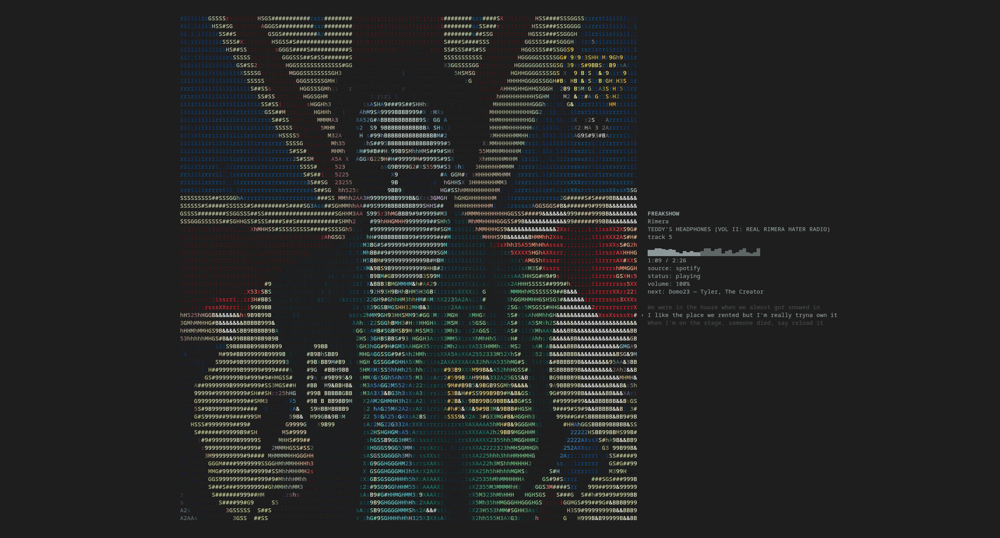

# NPIT

A lightweight music and video display for your Linux terminal. Follow your media player or play a folder directly, with ASCII artwork and video, an optional CAVA visualizer, and synced lyrics.



## Install

Install dependencies for your distribution family:

### Arch-based (Arch, EndeavourOS, CachyOS, Manjaro)

```sh
sudo pacman -S base-devel pkgconf curl json-c libpng libjpeg-turbo openssl cairo pango fontconfig glib2 libvlc vlc-plugins-base ffmpeg cava
```

### Debian-based (Debian, Ubuntu, Linux Mint)

```sh
sudo apt update
sudo apt install build-essential pkg-config libcurl4-openssl-dev libjson-c-dev libpng-dev libjpeg-dev libssl-dev libcairo2-dev libpango1.0-dev libfontconfig1-dev libglib2.0-dev libvlc-dev vlc-plugin-base ffmpeg cava
```

### RPM-based (Fedora)

```sh
sudo dnf install gcc make pkgconf-pkg-config libcurl-devel json-c-devel libpng-devel libjpeg-turbo-devel openssl-devel cairo-devel pango-devel fontconfig-devel glib2-devel vlc-devel vlc ffmpeg cava
```

Then build and install:

```sh
git clone https://github.com/buscook/npit.git
cd npit
make
sudo make install
npit
```

CAVA is optional. For MPV, install `mpv-mpris` so NPIT can detect it. Other players and browsers need to expose playback through MPRIS; the available metadata and controls depend on the player.

## Use

Run `npit` while your media player is playing, or use `npit /path/to/folder` to play local audio and video. You can also drag a file or folder into the terminal while NPIT is running. Dropping an empty or unreadable folder keeps your current song playing.

Local files play in the order returned by the folder, which may differ from your file manager's sorted view. Track numbers follow that order. Embedded titles and artist tags take priority over filenames; missing artist tags fall back to the displayed title. Video fills the art area, and the `cover` theme colors playback details using samples from across the video.

Try `npit --minimal --art-mode none` for a small display, `npit --player spotify` to choose a player, or `npit --no-visualizer` to hide CAVA. Use `npit --help` to see every option.

## Controls

Set `enabled = true` under `[controls]` in your settings file to enable playback keys. `q`, `Ctrl+C`, and dragging media into the terminal work even when keyboard controls are disabled.

| Key | Action |
| --- | --- |
| `q` or `Ctrl+C` | Quit NPIT. Built-in local playback stops when you quit. |
| `Space` | Play or pause. |
| `Right arrow` | Play the next track. |
| `Left arrow` | Play the previous track. For local files, restart the current track if more than three seconds have played. |
| `[` | Rewind five seconds. |
| `]` | Jump forward five seconds. |
| `+` or `=` | Raise volume by five percentage points. |
| `-` | Lower volume by five percentage points. |
| `s` or `S` | Toggle shuffle in an external player that supports it. |
| `r` or `R` | Toggle repeat. For local files, repeat the folder. |
| `l` or `L` | Show or hide synced lyrics. |
| `k` or `K` | Toggle censoring of explicit text. |
| Drop a file or folder | Start playing the dropped media in NPIT. |

Playback commands depend on what your external player supports. Keyboard toggles apply to the current session; edit your settings to make them permanent.

## Settings

Your settings file is created on first run. Find it with `npit --print-config-path`, or load a different file with `npit --config /path/to/settings.toml`.

Use `[display]` to choose which information appears, `[artwork]` for the art mode, `[colors]` for the theme, and `[lyrics]` or `[visualizer]` to adjust animations. Set `[performance].safe_render = true` for slower terminals. `[behavior].metadata_interval` controls backup metadata checks; player change notifications update the display immediately when available.

## Spotify queue and playlists

Spotify setup is optional; you can use NPIT without it. To show the next track and playlist, create an app in the [Spotify Developer Dashboard](https://developer.spotify.com/dashboard), add `http://127.0.0.1:8888/callback` as its redirect URI, and set the app's client ID before starting NPIT:

```sh
export SPOTIPY_CLIENT_ID="your-client-id"
npit
```

In Fish, use `set -gx SPOTIPY_CLIENT_ID "your-client-id"`. When Spotify is playing, NPIT opens your browser to request authorization; approve access and return to the terminal. Access depends on Spotify's current developer-app eligibility and API restrictions.

## License

MIT
